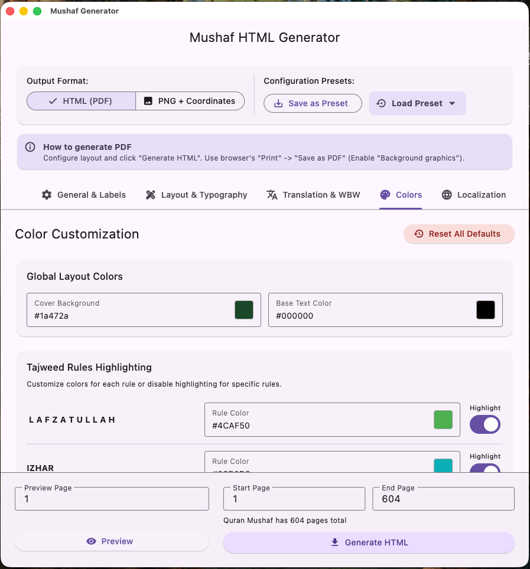
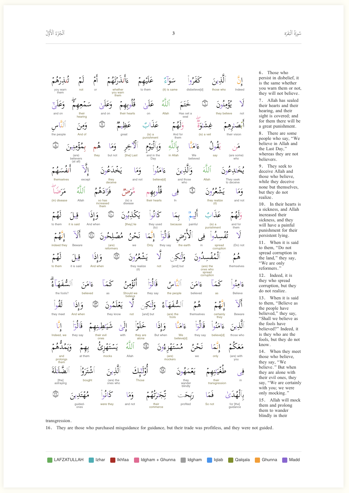

# Tajweed Quran Mushaf Generator

A Flutter desktop application designed to generate high-quality, print-ready HTML files of the Quran Mushaf with Tajweed color coding. The generated HTML is optimized for conversion to PDF using browser print functionality, supporting various page sizes and translation options.

## Screenshots

|                     Application UI                     |                       Generated Page Result                       |
| :----------------------------------------------------: | :---------------------------------------------------------------: |
|  |  |

## ⚠️ Disclaimer & User Responsibility

**This software is a tool for generating layouts, but it does not guarantee perfection in every scenario.**

Users are **solely responsible** for verifying the final output, including but not limited to:

- **Text Accuracy**: Ensuring Quranic text and translations are correct and have not been altered during generation.
- **Layout Integrity**: Checking for text overflowing, clipping, overlapping, or missing content, especially when using long translations or small page sizes.
- **Formatting**: Verifying that margins, page breaks, and font rendering are correct for the intended print medium.

**Always review every page of the generated HTML/PDF before printing or distribution.**

## Features

- **Tajweed Color Coding**: Precise character-level coloring for Tajweed rules:

  - 🟢 **LAFZATULLAH** (Allah's name) - Green
  - 🔵 **Izhar** - Cyan
  - 🔴 **Ikhfaa** - Red
  - 🩷 **Idgham with Ghunna** - Pink
  - ⚪ **Idgham without Ghunna** - Gray
  - 🔵 **Iqlab** - Blue
  - 🟢 **Qalqala** - Olive
  - 🟠 **Ghunna** - Orange
  - 🟣 **Madd (Prolonging)** - Purple

- **Flexible Page Formats**:

  - **Sizes**: Presets for A3, A4, B5, A5, and fully custom dimensions.
  - **Margins**: Configurable gutter margins for RTL book binding (odd/even page alternation).

- **Translation Support**:

  - **Side-column Translation**: Fetches translations from QuranEnc API or local JSON files.
  - **Word-by-Word (WBW)**: Interlinear translation support (e.g., English, Turkish, Indonesian).
  - **Compact Mode**: Automatically switches to inline translation layout for dense pages to prevent overflow.

- **Customization**:
  - **Cover Page**: Customize the title, subtitle, and background color.
  - **Structure**: Control the number of blank pages inserted after the cover.
  - **Typography**: Adjust font sizes for Arabic, translations, and headers.

## User Guide

### 1. Configuration

Use the application dashboard to set up your desired output:

- **Layout & Typography**:

  - Select a **Page Size** preset or enter custom dimensions.
  - Adjust **Margins** (Gutter, Outer, Top, Bottom) based on your printer or binding requirements.
  - **Cover Color**: Enter a Hex color code (e.g., `#1a472a`) for the cover background.
  - **Preface Blank Pages**: Set how many empty pages to insert between the cover and the Mushaf content.

- **Content Options**:

  - **Include Translation**: Adds a side column with translation. You can adjust the width fraction and font size.
  - **Include Word-by-Word**: Adds interlinear translation under each Arabic word.

- **Custom Text**:
  - You can rename the "Cover Title", "TOC Title", and other labels to suit your language or preference.

### 2. Generation

1. Set the **Page Range** (e.g., 1 to 604 for the full Quran).
2. Click **Generate HTML**.
3. The application will process the pages and automatically open the result in your default web browser.

### 3. Printing to PDF

To convert the HTML to a PDF file:

1. In your browser, press `Ctrl+P` (Windows/Linux) or `Cmd+P` (macOS).
2. **Destination**: Select "Save as PDF".
3. **Layout**: Portrait.
4. **Margins**: Set to **None** (the application handles margins via CSS).
5. **Options**: Check **Background graphics** (essential for Tajweed colors and cover background).
6. Click **Save**.

## Developer Instructions

### Prerequisites

- **Flutter SDK**: >=3.0.0
- **Platform**: macOS, Windows, or Linux (Mobile is not supported due to `sqflite_common_ffi` usage).

### Building and Running

1. Get dependencies:
   ```bash
   flutter pub get
   ```
2. Run the application:
   ```bash
   flutter run -d macos  # or windows/linux
   ```

### Project Structure

- `lib/mushaf_html_generator.dart`: Core logic for building the HTML DOM and CSS.
- `lib/mushaf_page_config.dart`: Definitions for page sizes and layout configuration.
- `lib/mushaf_preview_screen.dart`: Main UI for the application.
- `resources/`: Contains the SQLite databases (`qpc-v4-tajweed-15-lines.db`, `uthmani.db`).

### Data Integrity

The application implements strict bounds checking. If a word in the database does not match the expected Tajweed token structure, the generator will throw an exception to prevent printing incorrect Quranic text.
